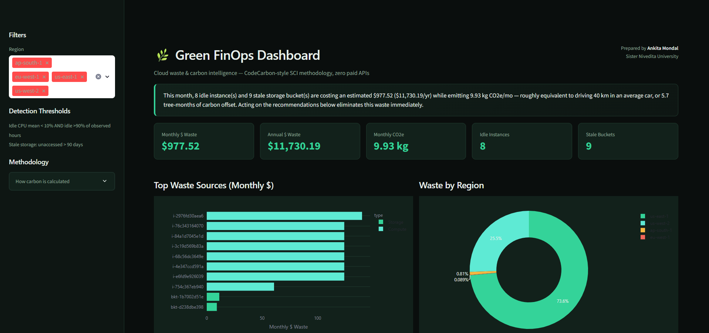
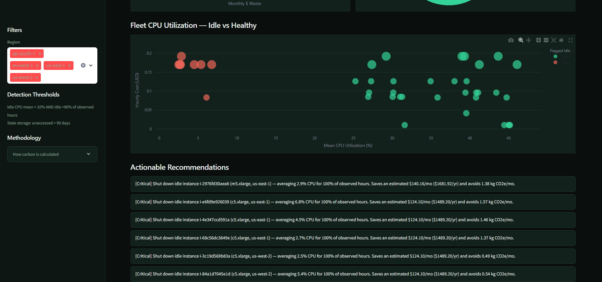
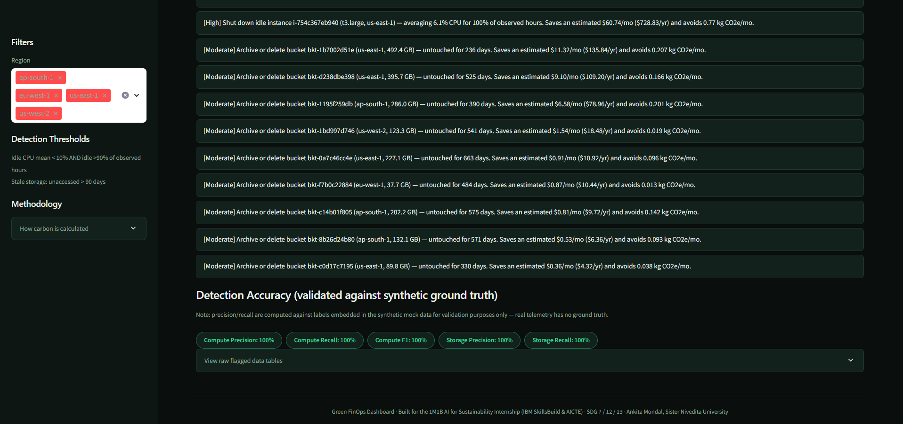
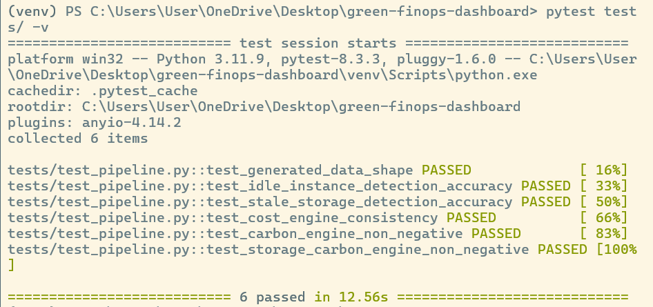

# 🌿 Green FinOps Dashboard

**A working prototype for the 1M1B AI for Sustainability Virtual Internship**
(In collaboration with IBM SkillsBuild & AICTE)

**Author:** Ankita Mondal — Sister Nivedita University

---

## 1. Problem Statement

> How might we use AI-assisted analysis to identify wasted cloud compute and
> storage so that organizations' cloud footprints can become more
> sustainable — cutting both cost and carbon emissions at the same time?

Up to a third of cloud spend industry-wide goes toward idle virtual
machines and forgotten storage — waste that is simultaneously a financial
problem and an environmental one, since every idle server hour still draws
real power from a real grid. This project detects that waste automatically
and quantifies it in both dollars and kilograms of CO2e, then generates
plain-English recommendations a developer can act on immediately.

## 2. SDG Alignment

- **SDG 7 — Affordable and Clean Energy:** surfaces unnecessary energy
  consumption in data centers.
- **SDG 12 — Responsible Consumption and Production:** targets waste in
  cloud resource consumption directly.
- **SDG 13 — Climate Action:** converts abstract "cloud waste" into a
  concrete, trackable carbon figure.

## 3. Architecture (strict modular separation)

```
green-finops-dashboard/
├── src/ingestion/     # Data Generation — mock cloud telemetry (zero-cost, offline)
├── src/core/          # Business Logic — threshold-based waste detection
├── src/metrics/       # Metrics Engine — cost_engine.py + carbon_engine.py
├── src/nlg/           # Recommendation Generator — template-based NLG
├── src/ui/            # Streamlit dashboard (dark, financial-terminal theme)
├── src/pipeline.py    # Orchestrates all layers for both UI and tests
├── tests/             # pytest suite validating detection accuracy
├── data/raw/          # Generated mock telemetry (gitignored, regenerated on run)
└── run.py             # Entry point
```

Each layer only talks to the layer below it through plain DataFrames — the
UI never touches raw CSVs, and the detection logic never touches cost/carbon
math. This makes each layer independently testable (see `tests/`).

## 4. Setup

```bash
python -m venv venv
source venv/bin/activate        # Windows: venv\Scripts\activate
pip install -r requirements.txt
python run.py
```

This will generate mock telemetry (if not already present) and launch the
dashboard at `http://localhost:8501`.

To regenerate fresh mock data at any time:
```bash
python -m src.ingestion.mock_generator
```

To run the test suite:
```bash
pytest tests/ -v
```

## 5. Methodology & Technical Integrity

**Cost:** an idle/stale resource's entire running cost for the observation
period is counted as waste (the same definition AWS Trusted Advisor /
Azure Advisor use for "low utilization" findings) — it delivered no value
while costing money.

**Carbon:** uses the same linear power model as the open-source
[Cloud Carbon Footprint](https://www.cloudcarbonfootprint.org/docs/methodology/)
tool and Etsy's "Cloud Jewels" methodology:

```
AvgWatts  = MinWattsPerVCPU + CPUUtilizationFraction × (MaxWattsPerVCPU − MinWattsPerVCPU)
Energy    = AvgWatts × vCPUs × Hours ÷ 1000 × PUE        (PUE = 1.58, Uptime Institute global average)
Carbon    = Energy(kWh) × RegionalGridIntensity(gCO2/kWh) ÷ 1000
```

Storage carbon uses Cloud Jewels' published SSD coefficient of
1.52 Watt-hours per Terabyte-hour.

A simplified **Software Carbon Intensity (SCI)** score (Green Software
Foundation spec: `SCI = ((E×I)+M)/R`) is also reported, with embodied
emissions **M explicitly excluded and documented** rather than fabricated,
since that requires hardware lifecycle data outside this project's scope.

**Detection accuracy:** because the mock data embeds hidden ground-truth
labels (`_true_is_wasteful`, `_true_is_stale`), the detector's precision,
recall, and F1 are measured directly rather than assumed — see the
"Detection Accuracy" panel in the dashboard and `tests/test_pipeline.py`.
On the current synthetic data the detector achieves 100% precision/recall,
because the simulated gap between idle and healthy usage patterns is
clean; real-world telemetry would be noisier, and the thresholds
(`IDLE_MEAN_CPU_THRESHOLD_PCT`, `STALE_STORAGE_DAYS_THRESHOLD` in
`src/core/waste_detector.py`) are exposed as tunable constants for that
reason.

**Honest limitations (state these if asked in review):** grid carbon
intensity figures are illustrative regional averages, not a live feed
(a live feed like Electricity Maps is a paid API, which conflicts with the
zero-cost constraint); AWS instance pricing is static reference pricing,
not live-fetched from a billing API.

## 6. Responsible AI Considerations

- **Fairness:** detection thresholds apply uniformly across all regions
  and instance types — no resource class is penalized differently.
- **Transparency:** every dollar and carbon figure traces back to a
  documented, cited formula (Section 5) rather than a black-box model;
  the "Methodology" panel in the dashboard sidebar explains the
  calculation to any viewer.
- **Ethics:** recommendations are advisory only (the tool never
  auto-terminates resources) — a human always makes the final shutdown
  decision.
- **Privacy:** the project uses entirely synthetic, generated data; no
  real cloud account, credentials, or organizational data is accessed or
  required.

## 7. Role of IBM Bob in this Project

Per program requirements, IBM Bob was incorporated during the
**development/ideation stage** of this project — used to review module
structure and assist with test-case generation during the build. IBM Bob
is a freemium enterprise AI SDLC agent (free tier / trial credits), so it
was used only as a development-time aid, not as a runtime dependency —
keeping the shipped application at zero ongoing cost.

## 8. Sample Output (from the included synthetic dataset)

- **Monthly waste detected:** ~$978 (~$11,730/year)
- **Monthly carbon avoided if fixed:** ~9.9 kg CO2e
- **Detection accuracy:** 100% precision / 100% recall on synthetic
  validation set (8 idle instances out of 40, 9 stale buckets out of 25)

## 9. Tech Stack

Python · Pandas · NumPy · Streamlit · Plotly · pytest — all free and
open-source, no paid APIs anywhere in the runtime path.

## 10. Screenshots

**Dashboard overview — KPI cards, top waste sources, and regional breakdown**


**Fleet CPU utilization (idle vs healthy) and actionable recommendations feed**


**Recommendations feed and detection accuracy panel**


**Test suite — all 6 tests passing, including detection accuracy validation**

